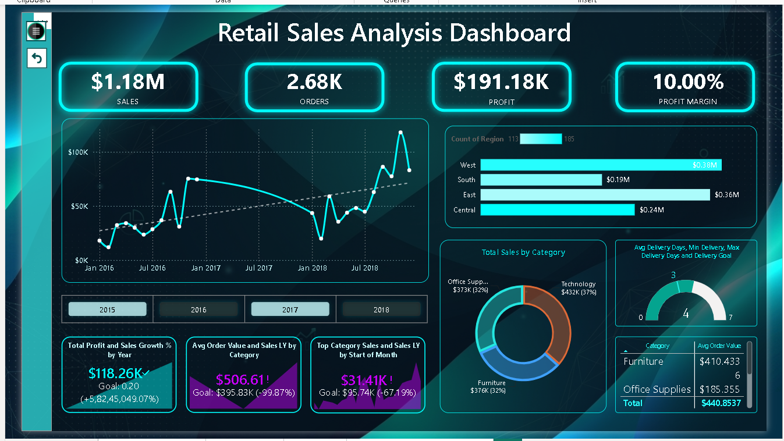
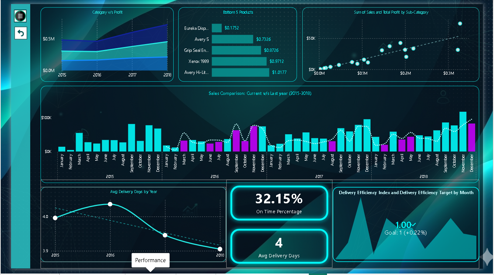
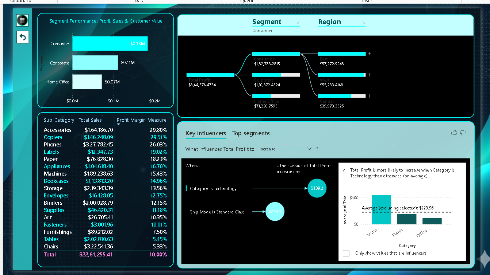
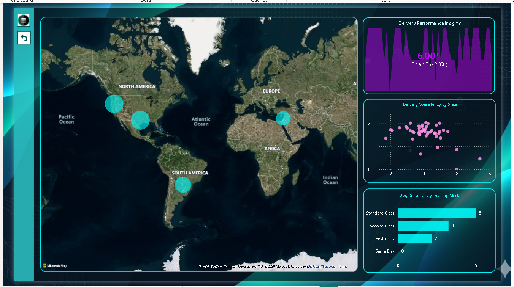

# 📊 Retail Sales Analysis Dashboard

A Power BI dashboard built using the Sample Superstore dataset from Kaggle to analyze retail sales performance and uncover business insights. This project focuses on sales trends, profitability, customer segments, regional performance, and delivery efficiency through interactive dashboards.

---

## 📌 Project Overview

Retail businesses generate large volumes of sales data every day, but making sense of that data can be challenging. This dashboard was created to provide a clear and interactive view of business performance, helping users monitor key metrics, identify trends, and support data-driven decision-making.

---

## 🎯 Objectives

- Analyze overall sales and profit performance
- Compare sales across regions and product categories
- Evaluate customer segment profitability
- Monitor delivery performance and shipping efficiency
- Identify high-performing and low-performing products
- Present business insights using interactive visualizations

---

## 📂 Dataset

- **Source:** Kaggle
- **Dataset:** Sample Superstore
- **Format:** CSV

The dataset contains information about orders, sales, profit, customer segments, categories, regions, shipping modes, and delivery dates.

---

## 🛠️ Tools & Technologies

- Power BI Desktop
- Power Query
- DAX
- Data Modeling
- CSV Dataset
- Microsoft Bing Maps

---

# 📊 Dashboard Pages

## 1️⃣ Executive Overview

Provides a quick summary of business performance through KPIs and trend analysis.

**Includes:**
- Total Sales
- Total Orders
- Total Profit
- Profit Margin
- Monthly Sales Trend
- Regional Sales
- Category-wise Sales
- Delivery Metrics



---

## 2️⃣ Performance Dashboard

Focused on sales performance across different years and products.

**Includes:**
- Sales Comparison (2015–2018)
- Category vs Profit
- Bottom 5 Products
- Sales vs Profit Analysis
- Delivery Efficiency
- Average Delivery Days



---

## 3️⃣ Customer & Product Insights

Analyzes customer segments, product categories, and profitability.

**Includes:**
- Customer Segment Analysis
- Profit by Segment
- Profit Margin by Sub-Category
- Decomposition Tree
- Key Influencers
- Regional Profit Distribution



---

## 4️⃣ Logistics Dashboard

Provides insights into shipping performance and delivery efficiency.

**Includes:**
- Global Sales Map
- Delivery Performance
- Delivery Consistency
- Average Delivery Days
- Shipping Mode Analysis



---

# 📈 Key Performance Indicators

- Total Sales
- Total Orders
- Total Profit
- Profit Margin
- Average Delivery Days
- On-Time Delivery Percentage
- Sales Growth
- Regional Sales Performance

---

# 💡 Key Insights

- Consumer customers generate the highest profit.
- Technology products contribute significantly to total profit.
- The West region records the highest sales performance.
- Standard Class shipping has the longest average delivery time.
- Some product sub-categories generate strong sales but relatively low profit margins.
- Sales show consistent growth over the observed years.

---

# ✨ Features

- Interactive Slicers
- KPI Cards
- Line Charts
- Bar Charts
- Donut Charts
- Scatter Plot
- Gauge Chart
- Matrix Table
- Decomposition Tree
- Key Influencers Visual
- Map Visual
- Drill-down Analysis
- Navigation Buttons

---

# 📁 Repository Structure

```
Retail-Sales-Analysis-Dashboard
│
├── Retail Analysis.pbix
├── SampleSuperstore.csv
├── Executive Overview.png
├── Performance.png
├── Customers and product insights.png
├── Logistics.png
└── README.md
```

---

# 🚀 Future Improvements

- Sales Forecasting
- Inventory Analysis
- Customer Lifetime Value Analysis
- Real-Time Data Integration
- SQL Database Connectivity
- Forecasting using Power BI AI Visuals

---

## 👤 Author

**Sehajpreet Kaur**

If you found this project useful, feel free to ⭐ this repository.

